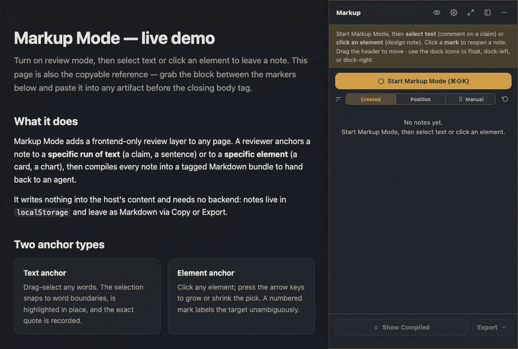
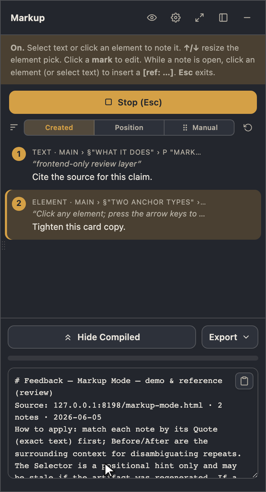

# Markup Mode

**Paste one file into any web page, leave precise feedback anchored to exact text or exact elements, and compile it to Markdown for a person or an AI agent to act on.** It needs no backend, no build step, and no dependencies, and it never changes the page's own content.

[](https://spunt.github.io/markup-mode/assets/templates/markup-mode.html)

<sub>**[Try the live demo](https://spunt.github.io/markup-mode/assets/templates/markup-mode.html)** · one HTML file, opens in any browser</sub>

## Why I built this

I kept hitting the same wall reviewing things in the browser, whether an AI-generated report or a draft landing page. I could see exactly what was off ("this number needs a source," "that axis starts at 50, not zero"), but I had no clean way to say *which* word or *which* element I meant. A screenshot loses the context. A comment on a whole `<div>` can't point at one clause in a sentence. And standing up a real review tool, with a database and an API and a login, is absurd overkill for jotting three notes on a page.

So Markup Mode is the small thing in between. You turn it on, click a sentence or an element, type a note, and it records a human breadcrumb, the exact quote, and a CSS selector. Hit compile and you get a tidy Markdown bundle you can paste straight back to whoever, or whatever, is going to fix it.

It came out of agent workflows specifically. An agent makes something, I mark it up where it actually renders, and the notes go back as instructions the agent can follow without guessing what I was looking at.

## Why you might want it

It's for anyone who reviews web artifacts and wants their feedback to be unambiguous: pinned to exact text or an exact element, without dragging in infrastructure.

A few ways it gets used:

- **Closing the loop on AI work.** An agent builds an artifact; you mark precisely what's wrong, in place; you paste the compiled notes back as a punch list. The agent acts on quotes and selectors instead of vague prose.
- **Design and copy review without a tracker.** Drop the layer into a staging page, leave element and text notes, and hand the Markdown to whoever's iterating. You don't need a Jira ticket or an extra seat.
- **Your own QA pass.** Walk a page you built, pin issues as you spot them, and export a checklist before you ship.

## What you hand back

Compile turns every note into a Markdown block meant to be acted on. The quote comes first, so a human or a model can find the spot even if the page was regenerated, and the selector is only a positional hint:

```markdown
# Feedback — Quarterly Report (review)
Source: reports/q2.html · 2 notes · 2026-06-04

## Note 1 · text
Where: Main › §"Results" › p "Conversion rose 18% in Q2…"
Quote: "rose 18%"
Selector (hint): main > section:nth-of-type(2) > p
Comment:
> Source for this figure? It contradicts the dashboard.

## Note 2 · element
Where: Main › §"Results" › div.chart
Selector (hint): main > section:nth-of-type(2) > .chart
Comment:
> Axis starts at 50, not 0, so it overstates the trend.
```



## Quick start

### Use it on a page (no install)

1. Open [`assets/templates/markup-mode.html`](assets/templates/markup-mode.html) in a browser. That file is itself a live demo.
2. To add it to **your** page, copy everything between the two `<!-- MARKUP MODE - copy from here / to here -->` markers (both `<style>` blocks and the `<script>`) and paste it just before your `</body>`.
3. *(Optional)* Match your design: point the seven `--mm-*` variables at your own tokens, or let it auto-detect common host variables. See [`references/adaptation.md`](references/adaptation.md).

Notes live in `localStorage` and go nowhere until you copy or export. Delete the pasted block and the file is byte-for-byte what it was.

### Use it as an agent skill

Markup Mode is also an agent skill: instead of pasting the block yourself, you tell your agent *"mark up this page"* and it applies the layer for you (`scripts/apply.sh`), then compiles your notes back as Markdown.

- **Any `SKILL.md`-aware agent (Claude Code, Codex, …).** Drop this repo into your agent's skills directory — e.g. `~/.claude/skills/markup-mode/` or `~/.agents/skills/markup-mode/` — so the agent reads `SKILL.md` at the root.
- **As a Claude Code plugin.**
  ```
  /plugin marketplace add spunt/markup-mode
  /plugin install markup-mode@markup-mode
  ```
- **By hand, no agent at all.** Skip the skill entirely — the "Use it on a page" steps above are all you need.

## How it works

- **Text anchors.** Drag-select a phrase. It snaps to word boundaries and highlights in place through the CSS Custom Highlight API, which paints over the text without touching the DOM, and it records the exact quote.
- **Element anchors.** Click to mark an element. Markup Mode now resolves the likely intended target instead of blindly using the browser's raw hit target, so nested controls, cards, and prose blocks behave more naturally. `↑`/`↓` grows or shrinks along that meaningful target chain, and a compact unnumbered mark plus an outline label it.
- **Adapts to the host.** It auto-detects common `:root` tokens like `--accent`, `--bg`, and `--text`, or you can set the colors, namespace, shortcut, and source path through `window.MarkupModeConfig`. Otherwise it falls back to sensible light and dark defaults.
- **A dock that stays out of the way.** It opens as a right-side rail by default, can minimize to a corner pill, and can also float or dock left. On wide screens rails reserve space instead of covering the page; on narrow screens they compact to the viewport so marks stay aligned with the page.
- **Markdown out.** The compiled bundle is shown as a read-only preview generated from the notes. Copy it, or download it as `<artifact>-markedup-<timestamp>.md`. You can also export a self-contained reviewed HTML file with the notes embedded.

Keyboard navigation works throughout, with a focus-trapped editor and ARIA-live status. The internals and the backlog are in [`references/`](references/).

## Customize it

You can tweak the look and keys for a single page right in the dock's gear panel (theme, accent, reduce motion). But the things you want to set *once and forget* — your accent color, a different toggle shortcut, the typeface, default behaviors — live in one place: **`markup-mode.config.jsonc`** at the repo root. Set them there and they bake into **every** markup file you generate from then on. It ships empty, so out of the box you get the same sensible defaults as everyone else.

It reads like this — set only the keys you care about:

```jsonc
{
  "accent": "#6366f1",
  "keymap": { "toggle": { "key": "m", "mod": true, "shift": true } },  // Cmd/Ctrl+Shift+M
  "behavior": { "themeMode": "dark" }
}
```

When you generate a marked-up file, anything you set here wins over the built-in default — and an explicit flag on the command (say `--accent "#0f766e"` for a one-off) wins over both. So the rule is simply: **command flag > config file > built-in default**.

Three ways to change it, whichever suits you:

1. **Edit the file by hand.** It's plain JSONC with comments and a `$schema` for editor autocomplete. Uncomment a key, set it, save.
2. **Run a command.** `scripts/config.sh set <key> <value>` validates the value and writes it for you, preserving your comments and other keys — e.g. `scripts/config.sh set accent "#6366f1"`. `scripts/config.sh list` shows every key and its current value; `scripts/config.sh help` lists them all.
3. **Just ask your agent.** Since Markup Mode is also a Claude Code skill, you can say *"set the markup-mode accent to #6366f1"* or *"rebind the markup-mode toggle to Ctrl+Shift+M"* and it'll run `config.sh` and update the config for you.

Full key list and the precedence details are in [`references/adaptation.md`](references/adaptation.md).

## Good to know

- **Browser support.** Text highlighting uses the [CSS Custom Highlight API](https://developer.mozilla.org/en-US/docs/Web/API/CSS_Custom_Highlight_API) (Chrome/Edge 105+, Safari 17.2+, Firefox 140+). Where it's missing, notes still work and list their quotes, and only the in-place highlight is skipped. Everything else is vanilla DOM.
- **Privacy.** Everything runs in the browser. Notes sit in `localStorage`, keyed per page, and leave only when you copy or export.
- **Quality.** A headless Playwright suite (`tests/regression.js`) backs it — run `node tests/regression.js` for the live pass/fail tally — plus adaptation checks against real artifacts. The handback format itself was tuned by an autoresearch loop measuring how reliably an agent can act on the notes without mis-editing; that result is written up in [`docs/handback-validation.md`](docs/handback-validation.md). The untested and deferred items, like touch input, bottom-edge docking, and a full screen-reader audit, are tracked in [`references/open-items.md`](references/open-items.md).

## License

[MIT](LICENSE) © 2026 Bob Spunt. Use it in anything, including commercial work. Keep the copyright notice.
